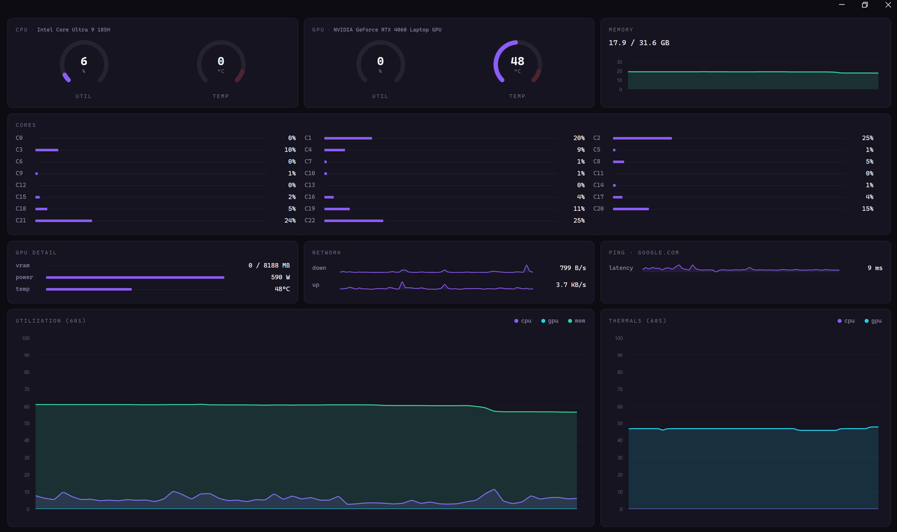

# modshell hwtest

A lightweight, always-on hardware monitor for Windows: CPU, GPU, memory,
per-core load, network throughput, and ping, all in one dark, dense
dashboard that refreshes every second, built with Avalonia and
LibreHardwareMonitor.




## Features

- **CPU**: total utilization, package temperature, per-core load
- **GPU**: utilization, temperature, power draw, VRAM used/total
- **Memory**: used/total with a live trend graph
- **Network**: upload/download throughput sparklines
- **Ping**: round-trip latency to a configurable host
- **60-second trend charts** for utilization and thermals
- **Adaptive core grid**: a readable label+bar list on mainstream CPUs,
  automatically switching to a compact color-coded tile grid once a chip
  has more cores than fit legibly (HEDT/workstation territory:
  Threadripper, Xeon, EPYC)

## Tech stack

- [.NET 8](https://dotnet.microsoft.com/) / C#
- [Avalonia UI](https://avaloniaui.net/) + FluentAvalonia, cross-platform-capable
  desktop UI, currently packaged for Windows
- [LibreHardwareMonitorLib](https://github.com/LibreHardwareMonitor/LibreHardwareMonitor),
  sensor access (CPU/GPU/memory/network)
- [LiveCharts2](https://livecharts.dev/), the trend graphs
- [CommunityToolkit.Mvvm](https://learn.microsoft.com/dotnet/communitytoolkit/mvvm/), MVVM plumbing
- [WiX Toolset v5](https://wixtoolset.org/), MSI installer packaging

## Running from source

Requires the [.NET 8 SDK](https://dotnet.microsoft.com/download/dotnet/8.0).

```powershell
dotnet run --project modshell-hwtest.csproj
```

Reading most sensors (temperatures, some load counters) requires
Administrator privileges on Windows: run the terminal elevated if values
show as blank or zero.

## Building the installer

The installer is a WiX v5 MSI: per-machine install into Program Files, a
Start Menu shortcut, and a normal entry in Apps & features.

```powershell
dotnet tool install --global wix --version 5.0.2
powershell -ExecutionPolicy Bypass -File installer\build-installer.ps1
```

This publishes a self-contained `win-x64` build and packages it into
`installer\output\modshell-hwtest-<version>.msi`. Pass `-Version` to stamp
a specific version number.

> WiX v7+ requires accepting a separate paid-maintenance-fee EULA
> ([details](https://wixtoolset.org/osmf/)) before it will build. This
> project pins WiX v5, which does not require that.

## Continuous integration and releases

- **CI** (`.github/workflows/ci.yml`): builds and publishes the app on
  every push and pull request against `main`, uploading the self-contained
  `win-x64` output as a workflow artifact.
- **Release** (`.github/workflows/release.yml`): triggered by pushing a
  tag matching `v*.*.*` (e.g. `v0.2.0`). Builds the MSI with the version
  taken from the tag and publishes it as a GitHub Release asset.

To cut a release:

```bash
git tag v0.2.0
git push origin v0.2.0
```

See [AGENTS.md](AGENTS.md) for the full tagging and release procedure.

## Roadmap

Ideas under consideration, roughly in priority order:

1. Multi-GPU / multi-NIC / multi-drive support (currently assumes one of each)
2. Disk I/O panel (per-drive read/write throughput)
3. Per-core clock speed alongside utilization
4. Threshold-based visual alerts (temp/util limits)
5. Top-process breakdown (CPU/GPU/memory consumers)
6. Fan RPM and per-rail power sensors
7. Pause/zoom/export on the trend charts
8. Dense/compact layout mode for smaller or larger displays
9. Dual-socket / NUMA-aware layouts for server boards

## License

No license has been chosen yet: all rights reserved by default until one is added.
